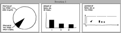

## XKCD #688

XKCD has an interesting plot in [#688]. They do a several plots that include
information about the plot in the comic. At first, this seems hard to
implement. While I was writing the simple code, I was thinking that I would
have to use a binary search or use some fancy method.

But no, since the image is correct and gradually converges to some value, you
just call the function over and over again.

This seems basic, but this is a complex mathematical problem. I'm guessing that
there's no closed form solution and if there was, it'd be almost impossible to
write down.

[#688]:https://xkcd.com/688/
